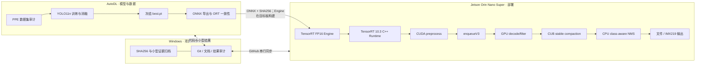
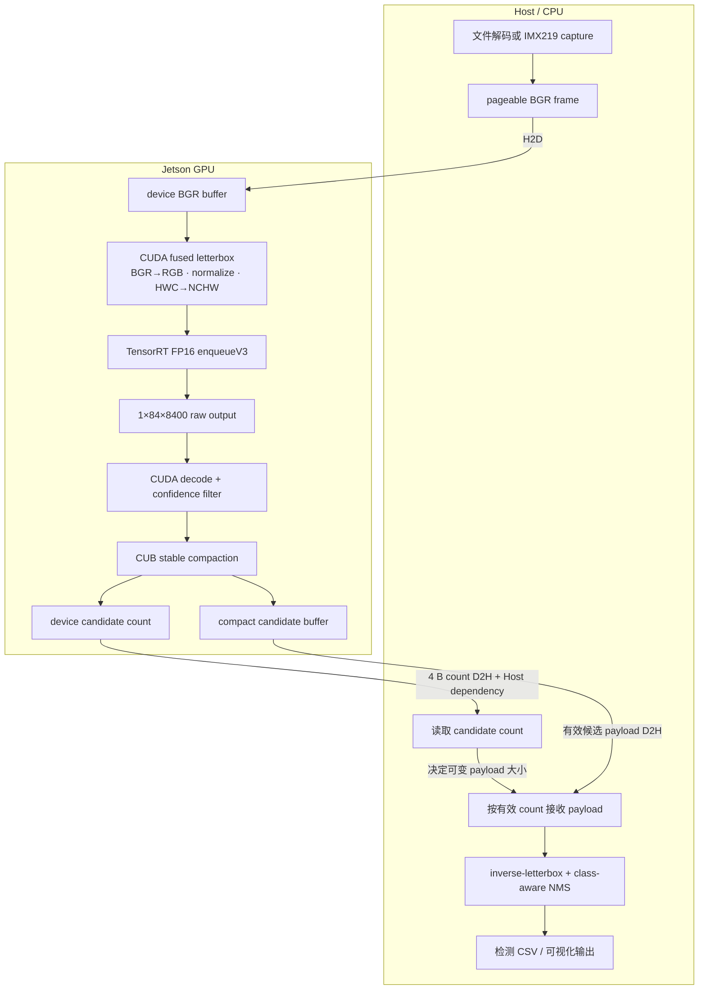

# 系统架构与最终数据流

## 1. 三端工程架构



模型产物不通过普通Git传输；TensorRT Engine只在目标Jetson构建。Windows上的代码保存不等于AutoDL训练或
Jetson部署验证通过。

## 2. V_Final 单帧数据流



最终路径保留同步的count读取和CPU NMS。Exp14 Double Buffer虽产生局部重叠但放大尾延迟；Exp16 Plugin、
Exp17 QDQ/Mixed和Exp18 Graph均完成实现或验证，但未通过系统级采用Gate，因此不在图中。

## 3. 计时边界

```text
GPU-only TensorRT：只回答Engine计算速度；不含真实输入、传输和后处理。
kernel-only CUDA：只回答Kernel本身；不含Host准备和传输。
post-capture processing：frame_total - capture_wait，适合分析30 FPS相机的可优化部分。
frame total / wall FPS：真实端到端结果，仍需结合输入节拍、DVFS和paired顺序解释。
```

任何结论均遵守：`Host API Duration ≠ GPU Activity ≠ Critical Path`。
